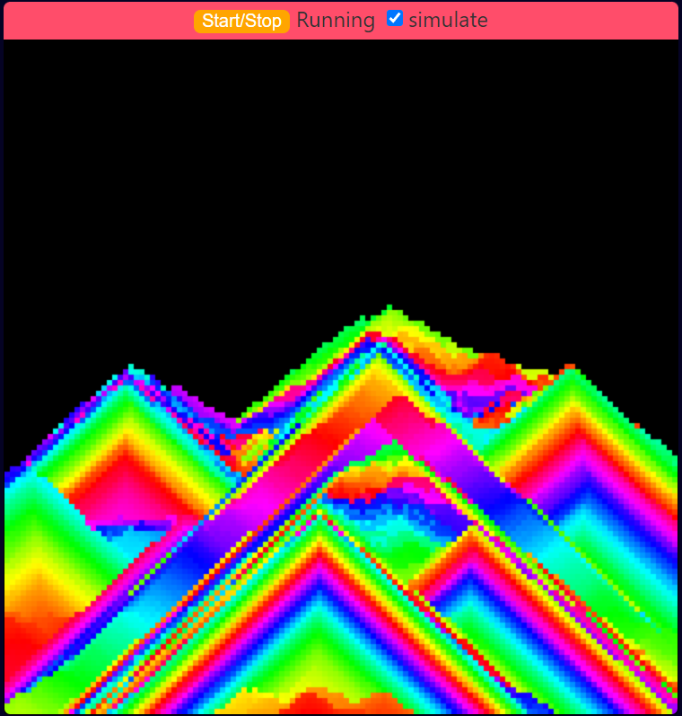

<h1>falling sand simulator</h1>

An amazing sand similator in pure HTML, CSS and JS. No frameworks at all!  
Calm yourself watching colour changing sand fall softly down. Make stunning pyramids and colourful creations of sand. Play about with it.

Take a look at some examples:  

